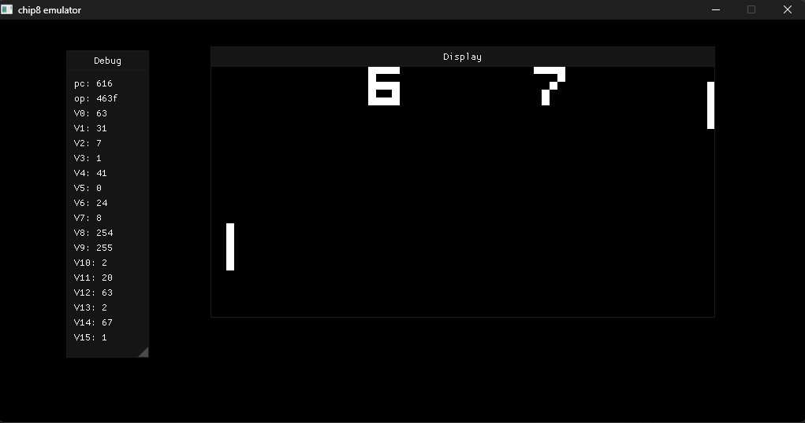

# chip8 emulator
A simple CHIP-8 interpreter written in C++.

Reference: https://www.cs.columbia.edu/~sedwards/classes/2016/4840-spring/designs/Chip8.pdf

# How to use
- Build the CMake target in the project root with your preferred compiler and settings.
- Place the `.ch8` ROM in the same directory as the executable.
- Update the ROM filename in [src/main.cpp](src/main.cpp) if needed.

